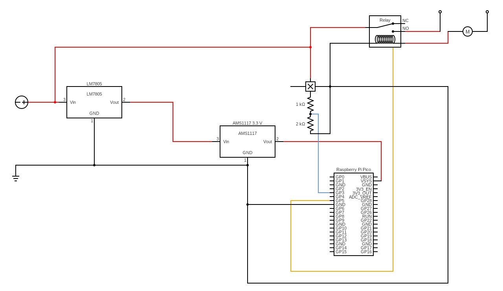

# Raspberry Pi Pico Based Automatic Water Pressure Pump Controller

## Getting started

Automatic pump controller is a sensor to automate your pump, you have to attach on water pump and fit together near loft tank to generate more pressure in your taps, showers.

### Tools Required

* [Raspberry Pi Pico](https://www.raspberrypi.com/products/raspberry-pi-pico/)
* [Water Flow Sensor](https://www.amazon.in/Thread-Sensor-Control-Flowmeter-SEN-HZ43WB/dp/B07Z41CSQ8)
* 10 Ω Resistors
* 12V Power Supply
* [LM7805 IC](https://www.electronicscomp.com/lm7805-ic)
* [AMS1117 3.3V Voltage Regulator](https://www.electronicscomp.com/ams1117-3.3v-power-supply-module)
* Relay

### Download SDK

```bash
git clone https://github.com/raspberrypi/pico-sdk.git --branch master
cd pico-sdk
git submodule update --init
cd ..
git clone https://github.com/raspberrypi/pico-extras
```

### Updating the SDK

```bash
cd pico-sdk
git pull
git submodule update
```

 ### Install the Toolchain [MAC]

```bash
brew install cmake
brew install minicom
brew install --cask gcc-arm-embedded
brew install --cask visual-studio-code
```

### VSCode Extensions

```bash
code --install-extension marus25.cortex-debug
code --install-extension ms-vscode.cmake-tools
code --install-extension ms-vscode.cpptools
```

### Steps To Build

```bash
export PICO_SDK_PATH="../../pico-sdk"
export PICO_EXTRAS_PATH="../../pico-extras"
```

>> Press <kbd>Command</kbd> + <kbd>P</kbd> to open Pallete.
>
>> Press <kbd>></kbd> & Search for CMake.
>
>> Select `arm-none-eabi-gcc`

### CMake & Build

```bash
 cmake -B ./build -G "Unix Makefiles"
 cd build
 make -j4
```

### Debug
```
  minicom -b 115200 -o -D /dev/cu.usbmodem21401
```

### Circuit Diagram

